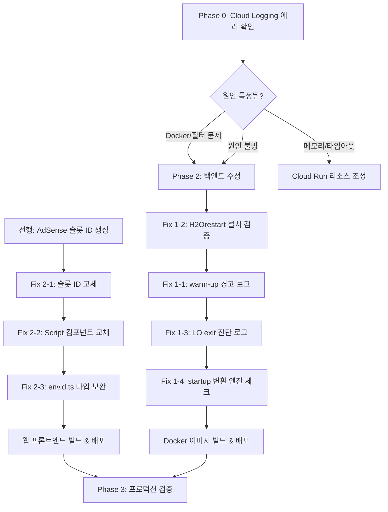

# HWP 변환 미작동 + 광고 미표시 수정 계획서

> 작성일: 2026-07-19 (rev.1)  
> 대상: **배포된 프로덕션 웹사이트** (hwp2pdf-499911)  
> 범위: 보안 이슈 제외, 기능 버그만 다룸  
> 선행 계획: [20260712 종합 코드 리뷰 개선 계획](20260712_comprehensive-review-remediation-plan.md) — 변환 서비스 에러 전파, 재시도 분기, GCS 원본 다운로드, trust proxy, HTML lang 등 이미 반영 완료

---

## 문제 1: HWP 변환이 작동하지 않음

### 원인 후보

배포 환경(Cloud Run)에서 HWP 변환이 실패하는 **가능한** 원인은 3가지이며, 실제 원인은 Phase 0에서 Cloud Logging 로그를 확인해야 특정된다.

#### A. Dockerfile warm-up 단계의 `|| true` 에러 삼킴

```dockerfile
# Dockerfile L51
&& /usr/lib/libreoffice/program/soffice --headless ... --terminate_after_init || true \
&& ls -la /app/.lo-profile || true \
```

`|| true`가 warm-up 실패를 삼키므로, H2Orestart 설치나 profile 초기화가 **실패해도 이미지 빌드가 성공**한다. 이 경우 변환 요청 시 LibreOffice가 HWP 파일을 인식하지 못하고 비정상 종료할 수 있다.

> 단, `unopkg add --shared`는 `&&` 체이닝이므로 실패 시 빌드 자체가 실패함. H2Orestart 설치 자체는 성공했을 가능성이 높고, warm-up 이후의 profile 초기화가 문제일 수 있다.

#### B. `FIXED_LO_PROFILE_DIR` 권한 문제 (가능성 낮음)

```typescript
// conversion-service.ts L13
const FIXED_LO_PROFILE_DIR = "/app/.lo-profile";
```

Dockerfile에서 warm-up이 root로 실행된 뒤 `chown -R hwp2pdf:hwp2pdf /app`으로 소유권을 일괄 변경하므로, **정상적으로 빌드되었다면 권한 문제는 발생하지 않는다.** 다만 warm-up이 `/app` 외부에 파일을 생성한 경우는 예외.

#### C. LibreOffice 런타임 환경 문제

- 컨테이너 메모리 제한으로 LibreOffice가 OOM 종료
- 변환 타임아웃 (`CONVERSION_TIMEOUT_MS`) 초과
- 한글 폰트 렌더링 실패 (fonts-nanum/fonts-noto-cjk 로드 실패)

### 수정 계획

#### Phase 0 (선행 — 원인 특정)

실제 Cloud Logging에서 변환 실패 로그를 확인하여 원인을 특정한다. 07-12 계획서에서 이미 구현된 `conversion_failed` 이벤트 로그 (`conversion-service.ts:67-74`)에 에러 메시지, 스택 트레이스가 포함되어 있으므로 이를 활용한다.

```bash
# Cloud Logging 조회 (GCP Console 또는 gcloud CLI)
gcloud logging read \
  'resource.type="cloud_run_revision" AND jsonPayload.event="conversion_failed"' \
  --project=hwp2pdf-499911 \
  --limit=20 \
  --format=json
```

확인할 항목:
- `error.message`: LibreOffice 종료 코드, stdout/stderr 내용
- `error.name`: `ENOENT`(바이너리 없음), `Error`(변환 실패) 등
- 발생 빈도: 모든 요청 실패 vs 특정 파일만 실패

> **이 단계의 결과에 따라 아래 Fix 1-1 ~ 1-4의 적용 범위가 달라진다.**

#### Fix 1-1: Dockerfile warm-up 에러 가시성 확보

**파일**: `apps/api/Dockerfile`

warm-up의 `|| true`를 제거하지 않되, 실패 시 경고를 출력하도록 변경한다. `ls`의 `|| true`는 유지한다 (LibreOffice 버전에 따라 warm-up이 파일을 생성하지 않을 수 있어 제거하면 빌드가 깨진다).

```diff
- && /usr/lib/libreoffice/program/soffice --headless --nologo --nofirststartwizard --norestore --invisible -env:UserInstallation=file:///app/.lo-profile --terminate_after_init || true \
+ && /usr/lib/libreoffice/program/soffice --headless --nologo --nofirststartwizard --norestore --invisible -env:UserInstallation=file:///app/.lo-profile --terminate_after_init 2>&1 || echo "WARN: LO warm-up exited non-zero (expected on some versions)" \
```

`ls || true`는 그대로 유지:
```dockerfile
&& ls -la /app/.lo-profile || true \
```

#### Fix 1-2: H2Orestart 설치 검증 단계 추가

**파일**: `apps/api/Dockerfile`

`unopkg add` 이후 설치 확인 로직 추가. `unopkg add` 자체는 `&&` 체이닝으로 실패 시 빌드가 멈추지만, 설치가 성공해도 필터가 제대로 등록되지 않는 경우를 잡기 위한 추가 gate:

```diff
  && /usr/lib/libreoffice/program/unopkg add --shared /tmp/H2Orestart.oxt \
+ && echo "--- H2Orestart extension verification ---" \
+ && /usr/lib/libreoffice/program/unopkg list --shared 2>&1 | grep -qi "h2orestart" \
+ || (echo "ERROR: H2Orestart filter not registered after installation" && exit 1) \
```

빌드 마지막(chown 이후)에도 확인 로그를 추가:

```diff
  && chown -R hwp2pdf:hwp2pdf /app /tmp/hwp2pdf
+ RUN echo "--- Final extension check ---" \
+   && /usr/lib/libreoffice/program/unopkg list --shared 2>&1 | head -20
```

#### Fix 1-3: 변환 실패 시 LibreOffice exit 진단 로그 추가

**파일**: `apps/api/src/services/conversion-service.ts`

07-12에서 구현된 `conversion_failed` 이벤트 로그와 **중복되지 않도록**, LibreOffice 프로세스의 `close` 이벤트에서만 exit code + stdout/stderr 요약을 별도 이벤트로 기록한다. 기존 `convertJobToPdf` catch 블록의 로그는 수정하지 않는다.

```diff
  process.on("close", (code) => {
    if (code === 0) {
      finish(resolve);
      return;
    }

    const details = [stdout.trim(), stderr.trim()].filter(Boolean).join("\n").slice(0, 2000);
-   finish(() => reject(new Error(details || `LibreOffice 변환이 종료 코드 ${code}로 실패했습니다.`)));
+   const diagMessage = details || `LibreOffice 변환이 종료 코드 ${code}로 실패했습니다.`;
+   // 기존 conversion_failed 이벤트(convertJobToPdf catch)와 별도로,
+   // LibreOffice 프로세스 수준의 진단 정보를 기록한다.
+   console.error(JSON.stringify({
+     level: "error",
+     event: "libreoffice_exit_nonzero",
+     exitCode: code,
+     stdoutTail: stdout.trim().slice(-500),
+     stderrTail: stderr.trim().slice(-500),
+   }));
+   finish(() => reject(new Error(diagMessage)));
  });
```

#### Fix 1-4: 변환 엔진 상태 확인 — startup 시 1회 체크

**파일**: `apps/api/src/app.ts` (또는 `server.ts`)

기존 `/health` 엔드포인트는 Cloud Run readiness/liveness probe 용도이므로 **가볍게 유지**한다. 대신 서버 startup 시 LibreOffice 가용성을 1회 체크하고 로그를 남긴다.

```typescript
// server.ts — 서버 시작 직후, listen 콜백 내부
import { execFile } from "node:child_process";
import { config } from "./config.js";

function checkConverterAvailability(): void {
  execFile(config.converterCommand, ["--version"], { timeout: 5000 }, (error, stdout) => {
    if (error) {
      console.warn(JSON.stringify({
        level: "warn",
        event: "converter_unavailable",
        command: config.converterCommand,
        error: error.message,
      }));
    } else {
      console.info(JSON.stringify({
        level: "info",
        event: "converter_available",
        version: stdout.trim().split("\n")[0],
      }));
    }
  });
}

// listen 콜백에서 호출
checkConverterAvailability();
```

기존 health 엔드포인트는 변경하지 않는다:

```typescript
// 기존 유지 — 변경 없음
router.get(API_ROUTES.HEALTH, (_request, response) => {
  response.json({ status: "ok" });
});
```

> ~~이전 계획의 `execFileSync` 사용은 health check마다 이벤트 루프를 최대 5초 블로킹하고, Cloud Run readiness probe 실패 시 인스턴스 재시작을 유발할 수 있어 철회.~~

---

## 문제 2: AdSense 광고가 표시되지 않음

### 원인 분석

#### A. `adSlot`에 임의 문자열 사용 (핵심 원인)

```tsx
// page.tsx L62
<AdSenseAd adSlot="hwp2pdf-top-banner" ... />

// page.tsx L156
<AdSenseAd adSlot="hwp2pdf-faq-inline" ... />
```

AdSense 광고 슬롯 ID는 **숫자 문자열** (예: `"1234567890"`)이어야 하지만, `"hwp2pdf-top-banner"` 같은 임의 영문 문자열이 들어가 있음. AdSense SDK가 해당 슬롯을 찾지 못해 빈 영역만 렌더링.

#### B. Next.js의 `<script>` vs `<Script>` 문제

```tsx
// layout.tsx L37-41
<script
  async
  src={`https://pagead2.googlesyndication.com/pagead/js/adsbygoogle.js?client=${ADSENSE_CLIENT}`}
  crossOrigin="anonymous"
/>
```

Next.js에서는 서드파티 스크립트를 `next/script`의 `<Script>` 컴포넌트로 로드해야 hydration 불일치 없이 정상 동작. 현재 raw `<script>` 태그를 `<head>` 내부에 직접 삽입하여, SSR과 클라이언트의 DOM 불일치 또는 스크립트 로딩 타이밍 문제 발생 가능.

#### C. `env.d.ts`에 타입 선언 누락

`NEXT_PUBLIC_ADSENSE_CLIENT`가 `env.d.ts` 타입 선언에 없어 TypeScript가 해당 환경변수를 인식하지 못함. 기능적 문제는 아니지만, 빌드 시 잠재적 경고 유발 가능.

### 수정 계획

#### 선행 작업: AdSense 광고 유닛 생성 (코드 변경 아님)

코드 수정 전에 반드시 완료해야 하는 외부 작업:

1. Google AdSense 콘솔 (https://www.google.com/adsense) 접속
2. `ca-pub-5221391672019535` 계정에서:
   - "광고" → "광고 단위별" → "새 광고 단위 만들기"
   - **배너형** 1개 (상단, 728×90 권장) → 숫자 슬롯 ID 기록
   - **직사각형** 1개 (FAQ 인라인, 300×250 권장) → 숫자 슬롯 ID 기록
3. 프로덕션 도메인이 AdSense에 등록/승인되어 있는지 확인

> 슬롯 ID가 확보되기 전에는 Fix 2-1을 진행할 수 없다.

#### Fix 2-1: 실제 AdSense 슬롯 ID 적용

**파일**: `apps/web/src/app/page.tsx`

선행 작업에서 확보한 숫자 슬롯 ID로 교체:

```diff
  <AdSenseAd
-   adSlot="hwp2pdf-top-banner"
+   adSlot="<상단_배너_숫자_슬롯_ID>"
    adFormat="horizontal"
    style={{ minHeight: 90, width: "100%", maxWidth: 728 }}
  />

  ...

  <AdSenseAd
-   adSlot="hwp2pdf-faq-inline"
+   adSlot="<FAQ_인라인_숫자_슬롯_ID>"
    adFormat="rectangle"
    style={{ minHeight: 250, width: "100%", maxWidth: 300 }}
  />
```

> 슬롯 ID를 환경변수(`NEXT_PUBLIC_ADSENSE_SLOT_TOP`, `NEXT_PUBLIC_ADSENSE_SLOT_INLINE`)로 관리하면 코드 변경 없이 슬롯 교체가 가능하지만, 현재 슬롯이 2개뿐이므로 과도한 추상화. 향후 슬롯이 늘어나면 그때 환경변수로 분리 고려.

#### Fix 2-2: `<script>` → `<Script>` (next/script) 교체

**파일**: `apps/web/src/app/layout.tsx`

```diff
  import type { Metadata } from "next";
  import { Geist, Geist_Mono } from "next/font/google";
+ import Script from "next/script";
  import { AuthProvider } from "@/auth/AuthProvider";
  import "./globals.css";

  ...

       <head>
         <meta charSet="utf-8" />
         <meta name="viewport" content="width=device-width, initial-scale=1" />
-        {ADSENSE_CLIENT && (
-          <script
-            async
-            src={`https://pagead2.googlesyndication.com/pagead/js/adsbygoogle.js?client=${ADSENSE_CLIENT}`}
-            crossOrigin="anonymous"
-          />
-        )}
       </head>
       <body className="min-h-full flex flex-col">
         <AuthProvider>{children}</AuthProvider>
+        {ADSENSE_CLIENT && (
+          <Script
+            async
+            src={`https://pagead2.googlesyndication.com/pagead/js/adsbygoogle.js?client=${ADSENSE_CLIENT}`}
+            crossOrigin="anonymous"
+            strategy="afterInteractive"
+          />
+        )}
       </body>
```

`strategy="afterInteractive"`를 사용하여 페이지 인터랙션 가능 후 스크립트 로드. AdSense SDK는 페이지 렌더링 후 광고를 삽입하므로 이 전략이 적합.

#### Fix 2-3: `env.d.ts` 타입 선언 보완

**파일**: `apps/web/src/env.d.ts`

```diff
  declare namespace NodeJS {
    interface ProcessEnv {
      NEXT_PUBLIC_API_BASE_URL?: string;
      NEXT_PUBLIC_FIREBASE_API_KEY?: string;
      NEXT_PUBLIC_FIREBASE_AUTH_DOMAIN?: string;
      NEXT_PUBLIC_FIREBASE_PROJECT_ID?: string;
      NEXT_PUBLIC_FIREBASE_STORAGE_BUCKET?: string;
      NEXT_PUBLIC_FIREBASE_MESSAGING_SENDER_ID?: string;
      NEXT_PUBLIC_FIREBASE_APP_ID?: string;
+     NEXT_PUBLIC_ADSENSE_CLIENT?: string;
    }
  }
```

---

## 수정 파일 목록

| Fix  | 파일 경로 | 변경 유형 |
|------|----------|----------|
| 1-1 | `apps/api/Dockerfile` | warm-up 경고 로그 추가 (`|| true` 유지) |
| 1-2 | `apps/api/Dockerfile` | H2Orestart 설치 검증 gate 추가 |
| 1-3 | `apps/api/src/services/conversion-service.ts` | LO exit 진단 로그 추가 (기존 로그와 중복 없음) |
| 1-4 | `apps/api/src/server.ts` | startup 시 1회 변환 엔진 체크 (비동기) |
| 2-1 | `apps/web/src/app/page.tsx` | AdSense 슬롯 ID를 실제 숫자 ID로 교체 |
| 2-2 | `apps/web/src/app/layout.tsx` | `<script>` → `<Script>` 컴포넌트 교체 |
| 2-3 | `apps/web/src/env.d.ts` | ADSENSE_CLIENT 타입 선언 추가 |

### 07-12 계획서에서 이미 완료된 관련 항목 (수정 불필요)

| 항목 | 파일 | 상태 |
|------|------|------|
| 변환 서비스 에러 전파 (`throw error`) | `conversion-service.ts:81` | ✅ 완료 |
| 재시도 가능 오류 분기 + 500 반환 | `v1.ts:680-695` | ✅ 완료 |
| GCS 원본 다운로드 후 변환 | `v1.ts:659-668` | ✅ 완료 |
| HWP OLE 시그니처 검증 | `upload.ts:41-51` | ✅ 완료 |
| HTML `lang="ko"` | `layout.tsx:30` | ✅ 완료 |
| Express `trust proxy: 1` | `app.ts:24-26` | ✅ 완료 |

---

## 작업 순서



### Phase 0 (선행 — 원인 특정)
1. Cloud Logging에서 `conversion_failed` 이벤트 조회
2. 에러 메시지와 종료 코드로 원인 특정
3. 원인에 따라 Phase 2의 적용 범위 결정

### Phase 1 (AdSense 슬롯 ID 확보 후 — 프론트엔드)
1. **선행**: AdSense 콘솔에서 광고 유닛 2개 생성
2. **Fix 2-1**: `page.tsx`의 `adSlot`을 실제 숫자 ID로 교체
3. **Fix 2-2**: `layout.tsx`에서 `<Script>` 컴포넌트 적용
4. **Fix 2-3**: `env.d.ts` 타입 선언 추가
5. 프론트엔드 빌드 후 Vercel 배포

### Phase 2 (Docker 재빌드 필요 — 백엔드)
1. **Fix 1-2**: Dockerfile에 H2Orestart 설치 검증 gate 추가
2. **Fix 1-1**: warm-up 에러 가시성 확보 (`|| true` 유지)
3. **Fix 1-3**: conversion-service.ts에 LO exit 진단 로그 추가
4. **Fix 1-4**: server.ts에 startup 변환 엔진 체크 추가
5. Docker 이미지 재빌드 → Cloud Build → Cloud Run 배포

### Phase 3 (배포 후 검증)
- 실제 `.hwp` 파일 업로드 → 변환 완료 → PDF 다운로드 검증
- Cloud Logging에서 `converter_available` 이벤트 확인
- Cloud Logging에서 `libreoffice_exit_nonzero` 이벤트 모니터링
- 광고 슬롯 렌더링 여부 Chrome DevTools에서 확인 (AdSense `ins` 태그에 광고 로드 확인)

---

## 사전 조건

| 항목 | 필요 조치 | 관련 Phase |
|------|----------|-----------|
| Cloud Logging 접근 | `hwp2pdf-499911` 프로젝트 로그 조회 권한 | Phase 0 |
| AdSense 계정 | `ca-pub-5221391672019535` 계정에서 광고 유닛 생성 | Phase 1 선행 |
| AdSense 도메인 승인 | 프로덕션 도메인이 AdSense에 등록/승인되어 있어야 함 | Phase 1 |
| Cloud Build 권한 | Docker 이미지 재빌드를 위한 Cloud Build 트리거 접근 | Phase 2 |
| Cloud Run 배포 | 새 이미지 배포를 위한 Cloud Run 서비스 업데이트 권한 | Phase 2 |

---

## 위험 관리

- Phase 0의 로그 분석 결과에 따라 Phase 2의 범위가 달라질 수 있다. 로그에서 원인이 명확히 특정되면 불필요한 Fix는 스킵한다.
- Dockerfile 변경(`|| true` 관련)은 기존 빌드를 깨뜨리지 않도록 보수적으로 적용한다.
- `/health` 엔드포인트는 변경하지 않는다 — Cloud Run readiness probe의 안정성을 보장하기 위함.
- Fix 1-3의 `libreoffice_exit_nonzero` 이벤트는 기존 `conversion_failed` 이벤트와 이벤트명이 다르므로 로그 중복이 발생하지 않는다.
- AdSense 슬롯 ID 확보가 지연되면 Phase 1의 Fix 2-2, 2-3만 먼저 배포하고, Fix 2-1은 ID 확보 후 별도 배포한다.

---

## 변경 이력

| 일자 | 내용 |
|------|------|
| 2026-07-19 | 초안 작성 |
| 2026-07-19 rev.1 | 교차 검증 결과 반영: Phase 0 추가, Fix 1-1 `ls \|\| true` 유지, Fix 1-4 startup 비동기 체크로 재설계, AdSense 선행 작업 분리, 07-12 완료 항목 참조 추가, 위험 관리 보완 |
